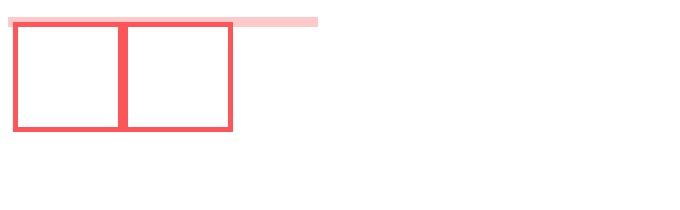
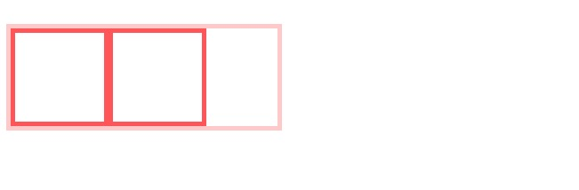
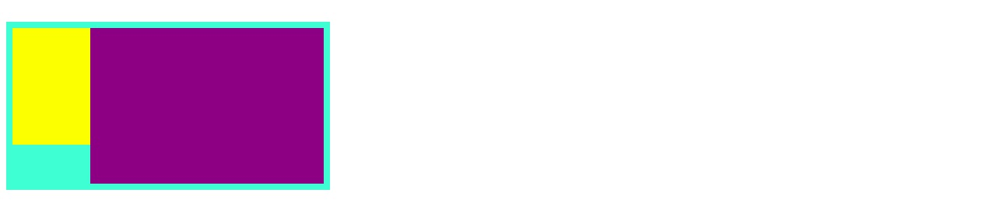

 # 理解CSS中的BFC

 ---

 [TOC]

##  什么是BFC
---
**文档流**
我们常说的文档流中分为定位流、浮动流和普通流三种。而普通流就是指BFC中的FC。

**Box**
Box 是 CSS 布局的对象和基本单位， 直观点来说，就是一个页面是由很多个 Box 组成的。元素的类型和 display 属性，决定了这个 Box 的类型。 不同类型的 Box， 会参与不同的 Formatting Context（一个决定如何渲染文档的容器），因此Box内的元素会以不同的方式渲染。

**FC** 
FC是formatting context的首字母缩写，直译过来是格式化上下文，它是页面中的一块渲染区域，有一套渲染规则，决定了其子元素如何布局，以及和其他元素之间的关系和作用。常见的FC有BFC、IFC，还有GFC和FFC。

**BFC**
BFC是block formatting context，也就是块级格式化上下文，是用于布局块级盒子的一块渲染区域。本文中主要介绍BFC。

**BFC布局规则**
* 内部的Box会在垂直方向，一个接一个地放置。
* Box垂直方向的距离由margin决定。属于同一个BFC的两个相邻Box的margin会发生重叠
* 每个元素的margin box的左边， 与包含块border box的左边相接触(对于从左往右的格式化，否则相反)。即使存在浮动也是如此。
* BFC的区域不会与float box重叠。
* BFC就是页面上的一个隔离的独立容器，容器里面的子*元素不会影响到外面的元素。反之也如此。
* 计算BFC的高度时，浮动元素也参与计算


---
    
##  触发BFC的条件
* 根元素， 即HTML元素
* float属性不为none
* position为absolute或fixed
* display为inline-block, table-cell, table-caption, flex, inline-flex
* overflow不为visible

---

##  BFC的作用及原理
* 清除内部浮动
**代码**
```html

    <style>
        .parent1 {
            width: 400px;
            background-color: #ef4567;
        }

        .child1 {
            float: left;
            height: 200px;
            width: 200px;
            background-color: pink;
        }
    </style>

<body>
    <h1>1. 清除浮动</h1>
    <div class="parent1">
        <div class="child1"></div>
        <div class="child1"></div>
    </div>
</body>

```
**效果**

根据**计算BFC的高度时，浮动元素也参与计算**这条规则，触发父容器生成BFC，这样父容器在计算高度时也会把浮动元素也计算在内，从而达到清除浮动的效果。
**代码** 
```
overflow: hidden;
```
**效果**


---

* 自适应两栏布局
**代码**
```html
<style>
        .parent2 {
            width: 300px;
            position: relative;
            background-color: aquamarine;
        }

        .child2 {
            width: 100px;
            height: 150px;
            float: left;
            background: yellow;
        }

        .child3 {
            height: 200px;
            background: purple;
        }
    </style>

     <div class="parent2">
        <div class="child2"></div>
        <div class="child3"></div>

    </div>
```

**效果**


上图的效果参照**每个元素的margin box的左边， 与包含块border box的左边相接触(对于从左往右的格式化，否则相反)。即使存在浮动也是如此。**
所以此时可以触发child3的BFC即可实现两栏布局
这个新的BFC不会与浮动的aside重叠。因此会根据父容器的宽度，和child2的宽度，自动变窄。效果如下：



